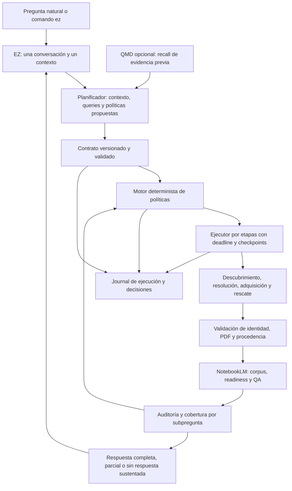

# EZresearchLM: plan técnico-operativo de implementación de EZ

Fecha de inspección: 2026-09-16. Estado: propuesta para revisión; no es una implementación ni una autorización de lanzamiento.

## 1. Alcance, evidencia y línea base

El objetivo es ofrecer un único agente, **EZ**, que reciba preguntas naturales, prepare el entorno, conserve contexto y ejecute una investigación reproducible. NotebookLM sigue siendo el motor de evidencia y QA. EZ puede planificar y explicar; no puede completar huecos académicos con memoria del modelo ni inventar citas. QMD y la búsqueda local sirven para localizar evidencia ya procesada.

Se leyeron completos `AGENTS.md`, `README.md` y `docs/ez-refurbish-operating-plan.md` antes de inspeccionar wrappers, adquisición, helpers NotebookLM, pruebas, configuración y documentación. Este documento desarrolla el plan operativo existente; no lo sustituye ni modifica. Las referencias de código corresponden al árbol de trabajo inspeccionado, incluidos los cambios locales, no solamente a HEAD. Las líneas cambiarán al implementar.

### 1.1 Estado de Git y trabajo que debe conservarse

- Rama observada: `main`; HEAD `964fa4d` (`Document file integrity checks`).
- Había 13 archivos versionados modificados, con 700 inserciones y 70 eliminaciones; el índice no tenía diferencias staged.
- Archivos modificados: `AGENTS.md`, `README.md`, `Rules_Of_Writing.md`, `notebooklm/scripts/batch_ask.py`, `packages/paper_search/paper_search_mcp/academic_platforms/anna_archive.py`, `packages/paper_search/run_search_topic_wrapper.py`, `packages/paper_search/search_topic.py`, `packages/paper_search/tests/test_search_topic.py`, `scripts/auto_login.ps1`, `scripts/run_hermes_answer.ps1`, `scripts/run_hermes_doctor.ps1`, `scripts/run_hermes_pipeline.ps1` y `scripts/run_search_topic.ps1`.
- Entradas untracked previas: `.tmp-notebooklm-080/`, los dos planes `docs/ez-refurbish-operating-plan.md` y `docs/ezresearch-failure-audit-plan.md`, `notebooklm/tests/`, `scripts/repair_notebooklm_links.ps1`, `scripts/run_validation.ps1`, `error`, `preparing` y `processing`.
- Todo lo anterior pertenece al usuario. No hacer reset, clean, stash, staging masivo ni commit automático. No asumir que los untracked son descartables. No incluir la copia temporal de NotebookLM en un paquete o commit sin inventario específico.
- La implementación deberá empezar con inventario y una rama de trabajo acordada que conserve estos cambios. Un worktree desde HEAD por sí solo no incluye esta línea base: habrá que incorporar selectivamente los cambios revisados, sin arrastrar corpus, credenciales ni artefactos reales.

### 1.2 Validación efectuada en esta inspección

| Comprobación | Resultado observado | Qué permite afirmar |
|---|---|---|
| `scripts/run_validation.ps1`, con `.venv/Scripts/python.exe` | Compilación correcta; 18 pruebas de paper search y 2 de NotebookLM correctas | La suite local existente pasa en este entorno |
| Parser PowerShell sobre `scripts/*.ps1` y `notebooklm/scripts/*.ps1` | 11 archivos; 0 errores | Sintaxis válida, no comportamiento correcto |
| Inspección de workflows | No existe `.github/` en el árbol inspeccionado ni workflows versionados | Falta CI en este repositorio |
| Smoke runner completo | No ejecutado en esta tarea | No se afirma éxito de setup ni de servicios externos |
| Corrida real autenticada de punta a punta | No ejecutada ni acreditada en esta tarea | **Lanzamiento no verificado** |

No se inició sesión, no se crearon notebooks ni se adquirieron papers para redactar el plan. El smoke actual llama setup con `-InitEnv`; por eso no se utilizó como una comprobación supuestamente de solo lectura. El reporte histórico de julio registra autenticación NotebookLM no disponible y un gate esperado como PASS ([reporte, líneas 39–62](C:/Users/Administrator/Documents/EZresearchLM/EZRESEARCHLM_SMOKE_AND_COST_REPORT.md:39)). El audit de entrega reconoce que no ejecutó E2E ([líneas 86–92](C:/Users/Administrator/Documents/EZresearchLM/EZresearchLM_DELIVERY_AUDIT.md:86)). El documento local de reparación describe QA y auditorías anteriores, pero no acredita por sí solo instalación limpia, ejecución completa y reanudación de la versión futura ([reparación, líneas 20–46](C:/Users/Administrator/Documents/EZresearchLM/docs/ezresearch-failure-audit-plan.md:20)).

## 2. Diagnóstico del estado actual

Prioridades: P0 compromete integridad o puede producir éxito falso; P1 impide continuidad o una experiencia confiable; P2 afecta mantenibilidad y adopción.

| ID | Hallazgo y evidencia por archivo/línea | Consecuencia y tratamiento |
|---|---|---|
| D01 · P1 | El producto documenta varios operadores y archivos de queries manuales ([README:18](C:/Users/Administrator/Documents/EZresearchLM/README.md:18)); el wrapper exige slug, goal, queries, notebook y dashboard, y todavía entrega un prompt para subagente ([pipeline:19](C:/Users/Administrator/Documents/EZresearchLM/scripts/run_hermes_pipeline.ps1:19), [pipeline:980](C:/Users/Administrator/Documents/EZresearchLM/scripts/run_hermes_pipeline.ps1:980)). `pyproject.toml` no declara entrypoint `ez` ([pyproject:22](C:/Users/Administrator/Documents/EZresearchLM/pyproject.toml:22)). | Hay piezas de ejecución, no una interfaz de producto única. Añadir EZ y mantener los wrappers como compatibilidad interna. |
| D02 · P1 | `StopIfMissingMustHave` se declara y persiste ([pipeline:51](C:/Users/Administrator/Documents/EZresearchLM/scripts/run_hermes_pipeline.ps1:51), [pipeline:288](C:/Users/Administrator/Documents/EZresearchLM/scripts/run_hermes_pipeline.ps1:288)); el gate de líneas 761–774 detiene siempre si faltan required ([pipeline:761](C:/Users/Administrator/Documents/EZresearchLM/scripts/run_hermes_pipeline.ps1:761)). | El flag no controla el bloqueo. Definir semántica efectiva y compatibilidad antes de tocar el condicional. |
| D03 · P1 | `required` es booleano; downloaded y notebook_ready se aceptan indistintamente al contar faltantes ([search:115](C:/Users/Administrator/Documents/EZresearchLM/packages/paper_search/search_topic.py:115), [pipeline:576](C:/Users/Administrator/Documents/EZresearchLM/scripts/run_hermes_pipeline.ps1:576)). | No representa criticidad por pregunta ni disponibilidad específica de cada etapa. Separar política, adquisición y readiness. |
| D04 · P1 | La respuesta reutilizada exige por defecto `MinSources=3`, `MinScore=15`; cuenta assets recuperables desde QMD y emite `NEEDS_CORPUS` ([answer:28](C:/Users/Administrator/Documents/EZresearchLM/scripts/run_hermes_answer.ps1:28), [answer:346](C:/Users/Administrator/Documents/EZresearchLM/scripts/run_hermes_answer.ps1:346), [answer:387](C:/Users/Administrator/Documents/EZresearchLM/scripts/run_hermes_answer.ps1:387)). | Cantidad y score de recuperación se confunden con suficiencia académica. Evaluar cobertura por subpregunta mediante QA, sin umbral universal. |
| D05 · P0 | Los cambios locales preservan el audit FAIL y detienen la salida final ([batch:274](C:/Users/Administrator/Documents/EZresearchLM/notebooklm/scripts/batch_ask.py:274), [batch:471](C:/Users/Administrator/Documents/EZresearchLM/notebooklm/scripts/batch_ask.py:471), [pipeline:1035](C:/Users/Administrator/Documents/EZresearchLM/scripts/run_hermes_pipeline.ps1:1035)). Pero el wrapper solo bloquea `fail`; `unknown` no activa ese gate ([pipeline:312](C:/Users/Administrator/Documents/EZresearchLM/scripts/run_hermes_pipeline.ps1:312), [pipeline:1048](C:/Users/Administrator/Documents/EZresearchLM/scripts/run_hermes_pipeline.ps1:1048)). | Conservar la reparación y completar el gate: auditoría ausente, desactualizada o vacía no equivale a aprobada. |
| D06 · P0 | El audit verifica enlaces y existencia de notas; no evalúa respaldo semántico ni existencia de cada ancla. Inicializa PASS sin exigir QA no vacío ([audit:21](C:/Users/Administrator/Documents/EZresearchLM/notebooklm/scripts/audit_qa_citations.py:21), [audit:63](C:/Users/Administrator/Documents/EZresearchLM/notebooklm/scripts/audit_qa_citations.py:63), [audit:82](C:/Users/Administrator/Documents/EZresearchLM/notebooklm/scripts/audit_qa_citations.py:82)). | Distinguir integridad mecánica, cobertura y respaldo de afirmaciones. Un enlace existente no prueba una conclusión. |
| D07 · P1 | La revisión previa ya existe y sale con código 3 ([wrapper:61](C:/Users/Administrator/Documents/EZresearchLM/packages/paper_search/run_search_topic_wrapper.py:61)); el fallo de trazabilidad imprime el mismo `NEEDS_SOURCE_RESCUE` que una fuente no adquirida ([pipeline:1040](C:/Users/Administrator/Documents/EZresearchLM/scripts/run_hermes_pipeline.ps1:1040)). | Preservar la revisión previa; agregar motivo, alcance, acción y capacidad de respuesta independientes del nombre legacy. |
| D08 · P1 | El enriquecimiento conserva un `pdf_url` principal; Unpaywall se consulta solo si no existe URL, y PMC puede sobrescribirla ([search:671](C:/Users/Administrator/Documents/EZresearchLM/packages/paper_search/search_topic.py:671)). Hay alternativas HTTP→HTTPS y una variante específica de PBMC ([search:529](C:/Users/Administrator/Documents/EZresearchLM/packages/paper_search/search_topic.py:529)). | Una URL existente pero fallida impide explorar todas las alternativas. Mantener una lista de ubicaciones y un grafo de intentos. Aprovechar las variantes locales como adaptador acotado. |
| D09 · P0 | La validación usa prefijo `%PDF` y tamaño para Anna; descarga directa comprueba prefijo y tamaño no nulo. El TGZ toma el primer PDF alfabético ([search:470](C:/Users/Administrator/Documents/EZresearchLM/packages/paper_search/search_topic.py:470), [search:573](C:/Users/Administrator/Documents/EZresearchLM/packages/paper_search/search_topic.py:573), [search:611](C:/Users/Administrator/Documents/EZresearchLM/packages/paper_search/search_topic.py:611)). | HTML evidente se rechaza, pero no se asegura estructura, identidad o selección del artículo correcto frente a suplementos. Añadir validación uniforme antes de NotebookLM. |
| D10 · P0 | El cambio local reintenta TLS con `verify=False` ([search:557](C:/Users/Administrator/Documents/EZresearchLM/packages/paper_search/search_topic.py:557)). | La firma PDF no sustituye la autenticidad TLS. Proponer CA del sistema/configuración institucional validada o ruta alternativa; no desactivar TLS automáticamente. No modificar este trabajo local durante la planificación. |
| D11 · P1 | `manual_needed` se convierte generalmente en `paywall`, y `failed` en `network` ([search:748](C:/Users/Administrator/Documents/EZresearchLM/packages/paper_search/search_topic.py:748)). | El diagnóstico atribuye causas no demostradas. Usar códigos específicos y `unknown_access_failure` cuando no haya evidencia suficiente. |
| D12 · P0 | `fallback_after` copia una lista fija que incluye `core_openaire_semantic`; los factories no implementan CORE/OpenAIRE ([search:38](C:/Users/Administrator/Documents/EZresearchLM/packages/paper_search/search_topic.py:38), [search:53](C:/Users/Administrator/Documents/EZresearchLM/packages/paper_search/search_topic.py:53), [search:717](C:/Users/Administrator/Documents/EZresearchLM/packages/paper_search/search_topic.py:717)). | La procedencia puede sugerir intentos que no ocurrieron. Derivarla exclusivamente del journal; `skipped` no es `attempted`. |
| D13 · P0 | Anna se habilita por flag o booleano de configuración ([search:985](C:/Users/Administrator/Documents/EZresearchLM/packages/paper_search/search_topic.py:985)). El adaptador contiene rutas SciDB y automatización declarada de desafíos JS ([anna:79](C:/Users/Administrator/Documents/EZresearchLM/packages/paper_search/paper_search_mcp/academic_platforms/anna_archive.py:79), [anna:258](C:/Users/Administrator/Documents/EZresearchLM/packages/paper_search/paper_search_mcp/academic_platforms/anna_archive.py:258)). | No existe recibo de consentimiento. El diseño futuro debe retirar la resolución automática de desafíos y revisar las rutas existentes. No integrar Sci-Hub ni mecanismos equivalentes de evasión. |
| D14 · P1 | Hay timeouts HTTP parciales y un proceso limitado para Anna ([search:491](C:/Users/Administrator/Documents/EZresearchLM/packages/paper_search/search_topic.py:491)), pero no deadline global en `as_completed`, `subprocess.run`, llamadas NotebookLM/QMD o `Wait-Job` ([search:653](C:/Users/Administrator/Documents/EZresearchLM/packages/paper_search/search_topic.py:653), [batch:69](C:/Users/Administrator/Documents/EZresearchLM/notebooklm/scripts/batch_ask.py:69), [pipeline:489](C:/Users/Administrator/Documents/EZresearchLM/scripts/run_hermes_pipeline.ps1:489), [uploader:61](C:/Users/Administrator/Documents/EZresearchLM/scripts/upload_sources_parallel.ps1:61)). | Un timeout de socket no limita toda una operación ni mata procesos descendientes. Centralizar supervisión y presupuestos. |
| D15 · P1 | Run-state se sobrescribe sin schema/version/eventos ([pipeline:260](C:/Users/Administrator/Documents/EZresearchLM/scripts/run_hermes_pipeline.ps1:260)); `ResumeState` recupera principalmente notebook_id ([pipeline:657](C:/Users/Administrator/Documents/EZresearchLM/scripts/run_hermes_pipeline.ps1:657)); reutilizar notebook salta todas las subidas ([pipeline:797](C:/Users/Administrator/Documents/EZresearchLM/scripts/run_hermes_pipeline.ps1:797)). | No basta para continuar tras rescatar un PDF nuevo. Reconciliar fuente/hash/ID remoto y ejecutar solo operaciones pendientes. |
| D16 · P1 | Hay rutas distintas: búsqueda sola `Search/<slug>-papers`, pipeline `Search/<project>/<slug>/papers`, documentación `Search/<project>/<slug>-papers` ([search wrapper:45](C:/Users/Administrator/Documents/EZresearchLM/scripts/run_search_topic.ps1:45), [pipeline:153](C:/Users/Administrator/Documents/EZresearchLM/scripts/run_hermes_pipeline.ps1:153), [source-rescue doc:8](C:/Users/Administrator/Documents/EZresearchLM/docs/source-rescue.md:8)). Doctor usa save_dir persistido, pero busca QA bajo AUTORESEARCH/Notes ([doctor:130](C:/Users/Administrator/Documents/EZresearchLM/scripts/run_hermes_doctor.ps1:130), [doctor:177](C:/Users/Administrator/Documents/EZresearchLM/scripts/run_hermes_doctor.ps1:177)). | Resolver rutas una sola vez, respetando vault externo y corridas legacy. No mover archivos por inferencia. |
| D17 · P1 | Setup instala el paquete, pero comprueba NotebookLM/QMD por separado; el pipeline requiere QMD antes de buscar ([setup:124](C:/Users/Administrator/Documents/EZresearchLM/scripts/setup_ezresearch.ps1:124), [setup:199](C:/Users/Administrator/Documents/EZresearchLM/scripts/setup_ezresearch.ps1:199), [pipeline:710](C:/Users/Administrator/Documents/EZresearchLM/scripts/run_hermes_pipeline.ps1:710)). | Onboarding incompleto; QMD impide tareas que no necesitan recall. Capacidades independientes y modo degradado explícito. |
| D18 · P1 | El smoke acepta código 1 o 2 como PASS para preflight sin comprobar causa; también crea `.env` si falta ([smoke:47](C:/Users/Administrator/Documents/EZresearchLM/scripts/run_smoke_tests.ps1:47), [smoke:121](C:/Users/Administrator/Documents/EZresearchLM/scripts/run_smoke_tests.ps1:121)). | Un fallo ajeno al gate esperado puede pasar. Tests deben comprobar estado, motivo y artefactos, además del exit code. |
| D19 · P2 | Dependencias principalmente con mínimos sin conjunto probado; empaquetado limitado a paper_search ([pyproject:11](C:/Users/Administrator/Documents/EZresearchLM/pyproject.toml:11)). Dos uploaders diferentes: uno especifica tipo/MIME, el otro no ([uploader:47](C:/Users/Administrator/Documents/EZresearchLM/scripts/upload_sources_parallel.ps1:47), [uploader legacy:46](C:/Users/Administrator/Documents/EZresearchLM/notebooklm/scripts/upload_sources_parallel.ps1:46)). | Fijar conjunto de versiones probado, empaquetar recursos y tener un solo adaptador efectivo detrás de los alias. |

La base tiene valor reutilizable: búsqueda multifuente, normalización, rescate incremental, separación de prioridad/acceso, wrappers, exportación de QA y reparaciones locales de trazabilidad. El refurbish debe extraer y fortalecer estas piezas en incrementos, no reescribirlas todas simultáneamente.

## 3. Arquitectura objetivo



### 3.1 Responsabilidades y fronteras

1. **Interfaz EZ:** entrypoint instalado `ez`, conversación en español por defecto según contexto, salida `--json` para automatización y `--debug` para detalles. Sin nombres de subagentes, prompts auxiliares o comandos PowerShell en el recorrido normal.
2. **Planificador EZ:** transforma pregunta y contexto en un plan estructurado. Puede usar un backend de modelo configurable detrás de la misma identidad. Propone estrategias; no ejecuta texto generado como shell ni declara evidencia suficiente por intuición. Una salida inválida se corrige una vez y luego pide la mínima aclaración necesaria.
3. **Núcleo determinista:** valida schemas, resuelve configuración/rutas, evalúa políticas y ejecuta etapas. Ninguna regla de integridad depende exclusivamente de obediencia a un prompt.
4. **Adaptadores:** paper search, cada proveedor, NotebookLM, QMD y wrappers legacy. Errores tipados y resultados estructurados; ningún adaptador decide por sí mismo que la investigación está completa.
5. **Almacén local:** contrato, fuentes, intentos, QA, auditorías y eventos con hashes. JSON/JSONL más blobs locales son suficientes inicialmente; no introducir servidor o base remota como requisito de beta.
6. **Presentador:** traduce estado estructurado a qué se pudo establecer, qué falta y siguiente acción. Solo utiliza afirmaciones asociadas a QA y citas verificables de NotebookLM. Metadatos bibliográficos provienen de proveedores/fuentes verificados.

### 3.2 Experiencia de los siete comandos

| Comando | Comportamiento esperado | Resultado persistente |
|---|---|---|
| `ez setup` | Detecta entorno; ofrece instalación local aislada y rutas; configura dependencias; guía login NotebookLM y registra capacidades. Repetirlo no pisa `.env` ni preferencias. Puede comprobar con `--check`. | `environment-report.json`, configuración local y versiones; nunca cookies en logs |
| `ez context` | Crea, muestra o revisa contexto por proyecto desde conversación. Distingue preferencias, hipótesis y hechos todavía no verificados. | `research-context.json` versionado |
| `ez research "pregunta"` | Selecciona contexto, aclara solo ambigüedades que cambian el alcance, guarda contrato, genera queries, investiga y consulta NotebookLM. `--plan-only` conserva el plan sin operaciones externas. | Nueva corrida y contrato; QA y respuesta si los gates lo permiten |
| `ez continue <run>` | Reconcilia checkpoints y estado remoto; retoma la etapa pendiente con el contrato congelado. No recrea automáticamente el notebook ni repite QA válida. | Nuevo attempt y eventos en la misma corrida |
| `ez status <run>` | Lectura local, sin red por defecto. Explica alcance completado, limitaciones y acciones; muestra si el estado remoto está desactualizado. | No modifica estado; `--refresh` registra comprobación externa explícita |
| `ez doctor <run>` | Diagnóstico por defecto de solo lectura: rutas, hashes, schema, auth, cuotas y trazabilidad. Las reparaciones se presentan como acciones concretas. | Reporte diagnóstico separado; `--apply <repair-id>` ejecuta la reparación autorizada |
| `ez rescue <run>` | Reintenta solo rutas elegibles, o importa un PDF con `--import <archivo> --source <id>`. Expone revisión/importación manual cuando corresponde. | Intentos, validación, procedencia, reevaluación de políticas y QA afectada |

`ez` sin argumentos abre la conversación guiada. Los identificadores de corridas son estables; slug es una etiqueta. Si dos corridas coinciden con el texto solicitado, EZ muestra opciones y no elige por fecha silenciosamente. Cancelar deja checkpoint. En modo no interactivo, una pregunta necesaria produce estado accionable y exit code; no espera entrada indefinidamente.

### 3.3 Setup y contexto para usuarios nuevos

- Resolver Python soportado, crear entorno aislado, instalar el paquete y el conjunto de dependencias probado. Cuando Python no exista, el bootstrap debe guiar instalación verificable; no asumir que `pip install` resuelve el arranque del producto.
- Detectar versiones y capacidades reales de NotebookLM y QMD. Instalar/configurar mediante procedimientos revisados y un manifiesto de versiones; actualizar herramientas es una operación distinta de comprobarlas.
- Login interactivo propiedad del usuario. EZ comprueba identidad de perfil y acceso con deadline; nunca acepta trust, copia cookies o registra cuentas por su cuenta.
- Capacidades independientes: `can_plan`, `can_discover`, `can_acquire`, `can_notebook_qa`, `can_recall`. Sin QMD, permitir investigación nueva y búsqueda de manifiestos locales; sin NotebookLM, permitir preparar corpus pero no respuesta académica final.
- Contexto: disciplina, proyecto, objetivo, población/objeto de estudio, fechas, idiomas, tipos de evidencia, exclusiones, fuentes nombradas, profundidad, preferencias de escritura, acceso disponible y presupuesto. Campos desconocidos quedan explícitos; no inventar antecedentes.
- Alcance del contexto: usuario → proyecto → corrida. Precedencia explícita de argumentos de esta corrida, contrato congelado al continuar, configuración de proyecto y valores por defecto. Cambiar contexto no reescribe corridas anteriores.
- Queries por proveedor, sinónimos, traducciones, inclusiones/exclusiones y criterio de parada guardados antes de ejecutar. Las preguntas NotebookLM finales se ajustan al corpus listo, en una nueva revisión del contrato. Guardar propuestas y ajustes, sin razonamiento privado extenso.

## 4. Políticas de evidencia y semántica del flag

### 4.1 Modelo por fuente y por afirmación

Una política se aplica a una fuente o requisito de evidencia **para subpreguntas/afirmaciones concretas**. No confundir antigüedad, calidad, relevancia, acceso y criticidad. Una fuente histórica puede ser central para una pregunta histórica. Una fuente reciente accesible no es automáticamente mejor ni suficiente.

| Política | Regla cuando falta | Condición de continuidad |
|---|---|---|
| `hard_block` | Inhabilita el alcance que depende de esa fuente/requisito. Bloquea toda la respuesta solo cuando el alcance es toda la pregunta o no queda ninguna parte sustentable. | Rescatar, aceptar una sustitución documentada que cumpla el requisito, o revisar el alcance por quien definió la obligación |
| `soft_block` | Señala carencia relevante y crea rescate recomendado. No obliga a detener toda la corrida. | Puede investigar y responder parcialmente si QA demuestra respaldo independiente de lo que se entrega |
| `contextual` | EZ propone criticidad según la pregunta, con referencias al contexto. Debe resolverse a una regla efectiva para cada alcance antes de publicar. | Si la ambigüedad puede cambiar una conclusión central, revisión; otras subpreguntas independientes pueden continuar |
| `historical` | Registra antecedente ausente; no bloquea por defecto. | No hacer afirmaciones sobre su contenido sin QA de esa fuente; reclasificar si pasa a ser evidencia central |
| `optional` | Registra omisión y motivo. | No cambia suficiencia por sí sola |

Cada asignación contiene `policy`, `effective_policy`, `scope_ids`, `rationale`, `assigned_by`, `decision_id` y `locked_by_user`. EZ no degrada silenciosamente una obligación impuesta por el usuario. Sustituciones deben identificar fuente reemplazada, versión, criterio de equivalencia y decisión; un suplemento no sustituye el artículo principal.

La evaluación ocurre al planificar, tras adquisición, tras readiness NotebookLM, tras QA y antes de presentar la respuesta. Aun con todas las fuentes presentes, QA puede revelar evidencia insuficiente o contradictoria. Diversidad y número de estudios son dimensiones justificadas por la pregunta, no un corte universal ni prueba de exhaustividad.

### 4.2 Semántica propuesta para `-StopIfMissingMustHave`

El flag legacy controla **únicamente el gate global por entradas legacy `must_have`/`required`**. No desactiva bloqueos de integridad, no otorga consentimiento Anna y no anula políticas explícitas del contrato.

| Entrada | Resultado efectivo propuesto para una corrida nueva |
|---|---|
| Flag presente/true y faltante legacy required | `hard_block` de alcance corrida, con `NEEDS_SOURCE_RESCUE` antes de QA dependiente |
| Flag ausente o `-StopIfMissingMustHave:$false`, sin contrato previo | Required legacy se interpreta como `soft_block`; continúa evaluación de evidencia y declara faltantes |
| Flag true sin faltantes | No bloquea; todavía debe pasar readiness, QA y auditoría |
| Flag false con una política explícita `hard_block` | La política explícita sigue activa |
| Cualquier valor con integridad fallida/desconocida | No publicar afirmaciones afectadas; permitir diagnóstico y reparación |
| Cualquier valor sin corpus utilizable | Preparar/buscar/rescatar; no producir respuesta académica sin QA |

Implementar comprobación de presencia mediante parámetros enlazados, no solo convertir el switch a booleano: al continuar, **ausencia significa heredar el contrato**, no false. Un false explícito que cambia una obligación persistida requiere una revisión registrada del contrato y, si estaba bloqueada por el usuario, su aprobación.

**Compatibilidad de corridas existentes:** el comportamiento efectivo anterior bloqueaba todos los required, incluso si run-state decía false. El importador legacy debe marcar `legacy_effective_gate=block_all_required` y preservar ese comportamiento al primer continue. No afirmar que false histórico ya significaba autorización de respuesta parcial. Mostrar una migración propuesta; cambiarla requiere decisión explícita. Corridas nuevas reciben la semántica corregida, documentada como cambio de comportamiento. No cambiar silenciosamente el significado en mitad de una corrida.

Pruebas obligatorias: true/false/omitido, corrida nueva/continuación, sin faltantes/con faltantes, contrato explícito, valor legacy false y fallo de integridad. No resolver D02 con un `if` aislado que permita ignorar evidencia central.

## 5. Estados: insuficiencia, respuesta parcial y bloqueo real

### 5.1 Dimensiones independientes

`run-state.json` v2 separa:

- `phase`: setup, plan, discover, resolve, acquire, validate, upload, readiness, qa, audit, answer, index.
- `execution.status`: pending, running, waiting_user, waiting_service, paused, completed, failed, cancelled.
- `evidence.coverage`: unknown, empty, insufficient, partial, sufficient. Evaluada por alcance; antes de QA es provisional.
- `integrity.status`: unknown, pass, warn, fail. Detallar identidad, hashes, corpus remoto, citas y anclas; cualquier unknown relevante impide publicar la afirmación correspondiente.
- `answer.status`: unavailable, partial, complete. Complete significa que responde el alcance acordado con límites declarados; no significa revisión exhaustiva de toda la literatura.
- `blockers[]`: categoría, motivo, alcance, políticas afectadas, acción requerida y si impide adquirir, preguntar o publicar.
- `allowed_actions[]`, `next_action`, `legacy_signals[]`, `last_event_seq`, `updated_at` UTC.

### 5.2 Correspondencia con los estados existentes

| Señal | Nuevo significado | Ejemplo de explicación de EZ |
|---|---|---|
| `NEEDS_CORPUS` | No hay corpus usable o no cubre algún alcance necesario. `answer.status` indica si existe una parte respondible. Error de QMD por sí solo es fallo de recall, no corpus vacío. | «La evidencia disponible permite abordar A, pero no B. Puedo entregar A con sus límites y buscar fuentes para B». |
| `NEEDS_SOURCE_RESCUE` | Existe una fuente concreta no adquirida, inválida o no lista. La política y el alcance determinan si bloquea. Puede coexistir con respuesta parcial. | «Falta la fuente que necesitas para la comparación B. La parte A está sustentada; B queda pendiente». |
| `NEEDS_SOURCE_REVIEW` | Hay una decisión humana concreta pendiente: selección previa solicitada, identidad ambigua, sustitución, cambio de alcance o consentimiento. No se usa como sinónimo de descarga fallida. | «Hay dos versiones y no puedo confirmar cuál corresponde al artículo requerido. Necesito que elijas antes de usarla». |
| `NEEDS_MORE_QA` | El corpus está disponible, pero faltan respuestas citadas suficientes para el alcance. | «Ya están las fuentes; falta verificar esta conclusión en NotebookLM». |
| `NEEDS_TRACEABILITY_REPAIR` (nuevo) | Hash, enlace, ancla, correspondencia de fuente o auditoría inválidos/desactualizados. Gate de integridad. | «La referencia no se puede verificar. Esa conclusión queda retenida hasta reparar su vínculo». |

Conservar señales legacy como proyección para consumidores antiguos. Nunca usar un único token como máquina de estados. Si hay revisión y rescate simultáneos, mostrar ambos y elegir la acción que desbloquea la siguiente etapa.

**Reglas de precedencia:** integridad falla o es desconocida → retener publicación afectada; restricción hard por fuente central → retener alcance dependiente; cobertura parcial auditada → entregar solo esa parte; cobertura suficiente auditada → respuesta completa para el contrato. Se pueden seguir ejecutando búsquedas o QA independientes mientras otras partes están bloqueadas. Si no puede aislarse la dependencia, se retiene toda la salida académica.

Proponer exit codes propios de `ez`: 0 operación solicitada completada (incluye respuesta parcial explícita), 2 intervención/revisión necesaria, 3 pausa o servicio transitorio, 4 integridad, 1 fallo técnico no recuperado. Los wrappers legacy mantienen inicialmente sus códigos actuales; el adaptador traduce estados, no reinterpreta solo stdout. `status` puede salir 0 aunque describa una corrida bloqueada: el comando de consulta fue correcto. Para automatización estricta, `research --require-complete` retorna 2 si la respuesta queda parcial.

## 6. Contratos, formatos y reproducibilidad

### 6.1 Artefactos y autoridad de cada uno

| Artefacto | Autoridad / contenido | Escritura y versión |
|---|---|---|
| `research-context.json` | Preferencias y contexto, con autor, alcance y nivel de verificación | Revisiones; corrida captura snapshot y hash |
| `research-contract.json` | Pregunta original, alcance, plan, queries, QA planificada, políticas, presupuestos y consentimientos referenciados | Revisión inmutable con schema; revisiones previas en `contracts/` |
| `sources.json` | Identidad de obra, versiones, ubicaciones, blobs validados, proveniencia y IDs NotebookLM | Ledger canónico por source_id; vistas derivadas para formatos legacy |
| `acquisition-attempts.jsonl` | Intentos reales y diagnósticos; rutas omitidas con motivo explícito | Append-only, intento iniciado y resultado |
| `decisions.jsonl` | Decisiones observables de usuario/EZ/política con entradas y motivo | Append-only, secuencia y hash del evento previo |
| `events.jsonl` | Inicio/fin de etapas, efectos externos y reconciliación | Append-only; fuente para reconstruir proyección |
| `run-state.json` | Snapshot operativo reconstruible de contrato + eventos | Escritura temporal y reemplazo atómico, revisión monotónica |
| `qa-manifest.json` | Preguntas, respuestas crudas, conjunto exacto de fuentes, citas y hashes | Versionado por intento/corpus |
| `audit.json` / `coverage.json` | Resultado mecánico, respaldo por afirmación, huecos y alcance | Ligados al hash de QA y corpus; nunca elegir solo por mtime |
| `STATUS.md`, `source-rescue.json`, `missing-sources.md`, `candidate-sources.json`, `download-plan.md` | Vistas humanas y adaptadores para consumidores existentes | Generadas desde estado canónico; no fuentes de verdad rivales |

No duplicar todo el historial dentro del contrato: mantener referencias relativas más hashes a los journals. Esto satisface el contrato reproducible sin convertir cada actualización en la reescritura del historial completo. Credenciales se referencian por perfil; nunca guardar tokens, cookies o URLs firmadas completas en artefactos compartibles.

### 6.2 Ejemplo normativo de estructura del contrato

Ejemplo sintético de diseño, no una corrida ejecutada ni evidencia bibliográfica. Los valores entre ángulos se resolverán al crear la corrida.

```json
{
  "schema_version": "2.0",
  "contract_id": "rc-example",
  "revision": 1,
  "parent_contract_hash": null,
  "run_id": "run-example",
  "created_at": "<UTC ISO-8601>",
  "question": {"original": "<pregunta del usuario>", "language": "es"},
  "context": {"path": "context-snapshot.json", "sha256": "<hash>"},
  "scope": [{"id": "sq1", "question": "<subpregunta>", "central": true}],
  "plan": {
    "queries": [{"id": "q1", "provider": "crossref", "text": "<query>", "scope_ids": ["sq1"]}],
    "notebook_questions": [{"id": "nq1", "scope_ids": ["sq1"], "text": "<pregunta citada>", "status": "proposed"}],
    "stop_rule": "<criterio de parada justificado>"
  },
  "source_policies": [{
    "source_id": "src-example",
    "policy": "contextual",
    "effective_policy": null,
    "scope_ids": ["sq1"],
    "rationale": "<motivo verificable>",
    "locked_by_user": false,
    "decision_id": "dec-example"
  }],
  "acquisition": {"anna_enabled": false, "consent_id": null, "policy_version": "2.0"},
  "budgets": {"run_seconds": 3600, "source_seconds": 600, "attempts_per_route": 3},
  "reproducibility": {
    "git_commit": "<sha>", "dirty": true, "code_manifest_sha256": "<hash>",
    "dependency_lock_sha256": "<hash>", "operator": "EZ",
    "backend": "<configured>", "model": "<reported model id>",
    "prompt_version": "<version>", "planner_output_sha256": "<hash>"
  },
  "artifacts": {
    "decisions": "decisions.jsonl", "attempts": "acquisition-attempts.jsonl",
    "notebook_state": "notebook-state.json", "audit": "audit.json",
    "coverage": "coverage.json", "answer": "answer-manifest.json"
  }
}
```

El esquema de producción añadirá versiones de herramientas, raíces efectivas, selección de proveedores, límites de costo y políticas de privacidad. No asignar un modelo concreto por defecto en el plan: elegir backend soportado y presupuesto en la decisión de producto A2. Si el modelo no informa su versión exacta, guardar `unknown` con el identificador disponible; no fabricarla.

### 6.3 Formatos de eventos, fuentes y respuesta

- **Decisión:** `schema_version`, `event_id`, `seq`, `at`, `actor`, `kind`, `input_hashes`, `contract_revision`, `options_considered`, `selected`, `reason`, `scope_ids`, `consent_ref`, `previous_hash`, `event_hash`. Guardar justificación breve y evidencia consultada, no chain-of-thought. Correcciones crean eventos compensatorios.
- **Intento:** `attempt_id`, `source_id`, `provider`, `route`, `started_at`, `ended_at`, URL solicitada/final saneadas, redirects saneados, `http_status`, `content_type`, bytes, `deadline_ms`, número de intento, `retry_after`, `result`, `failure_code`, evidencia diagnóstica mínima, hash del blob y validador. Un intento interrumpido permanece como `interrupted`, no como inexistente.
- **Fuente:** separar `work_id`, `version_id`, `source_id`, DOI/PMID/PMCID, metadatos con origen por campo, `locations[]`, acceso/licencia declarados, `identity_status`, `acquisition_status`, `validation_status`, `notebook_status`, `content_sha256`, `notebook_source_id` y políticas por scope. Preprint y versión publicada se relacionan, no se fusionan ciegamente.
- **Cobertura:** cada `scope_id` tiene fuentes candidatas, fuentes listas, QA ejecutada, afirmaciones sustentadas, contradicciones, huecos y nivel de cobertura. Dos registros del mismo trabajo no cuentan como dos evidencias independientes.
- **Respuesta:** `answer_id`, revisión de contrato, hash de corpus y QA, `status`, `claims[]` con `claim_id`, texto, `scope_ids`, `qa_ids`, citas originales y mapa `notebook_source_id → source_id → content_sha256 → nota/ancla`; más limitaciones, omisiones y acciones siguientes. La respuesta final preserva marcadores de QA hasta resolverlos; nunca crea marcadores ficticios.
- **Consentimiento Anna:** `consent_id`, actor, fecha, alcance de corrida/fuentes, texto de autorización, versión de política, posibilidad de revocación y estado. Persistir una autorización vigente evita preguntar repetidamente dentro del mismo alcance; ampliarlo requiere otro consentimiento.

### 6.4 Invariantes de almacenamiento y ejecución

Schemas JSON versionados, validación en lectura/escritura y fixtures válidos/inválidos. Lectores rechazan major desconocido de forma explicada; campos extensibles tienen namespace. Todo timestamp UTC; rutas relativas a raíces registradas y normalizadas, sin traversal. SHA-256 sobre bytes reales y JSON canónico donde corresponda.

Un único escritor por corrida mediante lock/lease; secuencia monotónica y escrituras atómicas. Antes de un efecto externo registrar intención; después registrar recibo e ID remoto. Si cae entre ambos, `continue` reconcilia antes de repetir. No prometer exactly-once sobre un servicio que no lo ofrece. Mantener backups locales y pruebas de recuperación ante truncado de la última línea del journal.

Dos modos de reproducibilidad: **replay** reconstruye decisiones/resultados con snapshots guardados sin llamadas externas; **rerun** vuelve a consultar proveedores/NotebookLM en un attempt nuevo y registra diferencias. Misma pregunta y mismo modelo no garantizan la misma respuesta. En árbol dirty, el commit no basta: guardar manifiesto de hashes del código pertinente, sin incluir secretos o corpus en patches exportables.

## 7. Reconstrucción de recuperación de papers

### 7.1 Flujo y proveedores

Separar descubrir obras, resolver identidad, localizar versiones y adquirir bytes. Descarga fallida no significa inexistencia, irrelevancia ni ausencia de literatura. Acotar resultados por query/proveedor con paginación explícita y criterio de parada; guardar qué se consultó y qué se descartó.

| Orden preferente | Ruta / trabajo concreto | Condición de aceptación |
|---|---|---|
| 1 | URLs PDF conocidas; conservar todas las ubicaciones previas. Seguir redirects limitados, normalizar enlaces relativos y probar HTTP→HTTPS. Variantes documentadas por sitio en adaptadores pequeños. | TLS válido, identidad coincidente, PDF validado; sin downgrade automático HTTPS→HTTP |
| 2 | DOI resuelto con metadatos de Crossref/proveedor y landing page editorial; extraer enlaces públicos de artículo, versión aceptada y suplementos como candidatos separados. | Enlace observado en metadatos/página, no una URL inventada; respeto del acceso autorizado |
| 3 | PMID/PMCID, PMC OA y Europe PMC; consultar endpoints de identificadores, ubicaciones y paquetes autorizados. | PMCID no se interpreta como licencia OA universal; elegir el artículo dentro de archivos, no el primer PDF |
| 4 | OpenAlex y Unpaywall; consultar todas las ubicaciones aplicables, con versión y licencia reportadas. | Una URL fallida no inhibe la consulta de otras ubicaciones |
| 5 | CORE y OpenAIRE como adaptadores reales, repositorios institucionales y disciplinares, preprints/manuscritos de autor. | Identidad y relación de versión verificadas; disponibilidad del proveedor no obliga a que exista full text |
| 6 | Enlace legal o PDF aportado por el usuario; guía para biblioteca, acceso institucional o autor. | Importación local auditada; EZ no automatiza el acceso restringido ni pide cookies institucionales |
| 7 | Anna, solo opt-in vigente y tras agotar o justificar rutas anteriores | Procedencia completa, validación y ninguna evasión de restricciones/desafíos |
| 8 | Cola de rescate | Diagnóstico, próximos pasos y alcance afectado; respuesta parcial cuando sea viable |

La ejecución puede paralelizar consultas independientes dentro del presupuesto, pero la decisión de recurrir a Anna siempre depende de resultados/omisiones registrados de las rutas anteriores. No declarar consultado un proveedor deshabilitado por falta de credencial.

Documentación externa contrastada para el diseño: [PMC OA Web Service](https://pmc.ncbi.nlm.nih.gov/tools/oa-service/), [API CORE](https://core.ac.uk/services/api), [OpenAIRE Graph API](https://graph.openaire.eu/docs/apis/graph-api/) y [autenticación OpenAIRE](https://graph.openaire.eu/docs/apis/authentication/). Se implementarán adaptadores contra contratos documentados y pruebas de compatibilidad, no contra supuestos sobre disponibilidad universal.

OpenAlex documenta autenticación, presupuestos y headers de rate limit; su documentación consultada indica un máximo de `per_page=100`, mientras el adaptador actual permite hasta 200. Corregir este desfase como parte del contrato del proveedor, sin atribuirle por sí solo todos los fallos actuales ([autenticación y límites OpenAlex](https://help.openalex.org/api/authentication/), [adaptador actual:57](C:/Users/Administrator/Documents/EZresearchLM/packages/paper_search/paper_search_mcp/academic_platforms/openalex.py:57)). Revisar nuevamente límites y condiciones al implementar; no fijar precios ni cuotas comerciales desde reportes antiguos. La consulta de documentación Europe PMC falló en esta inspección: verificar su contrato público antes de cerrar ese adaptador.

### 7.2 Identidad y validación uniforme

1. Normalizar identificadores con reglas por proveedor, conservar original y origen. Resolver conflictos entre DOI, título, autores y año; una coincidencia ambigua pasa a revisión.
2. Crear destino temporal por attempt; imponer máximo de bytes, redirects, tiempo y expansión de archivos. Nunca sobrescribir un PDF del usuario ni un blob validado.
3. Comprobar MIME, magic bytes y estructura con parser PDF; contar páginas y detectar cifrado, truncado y errores. Un PDF escaneado válido se marca `text_extraction_pending`, no corrupto por carecer de texto.
4. Verificar correspondencia con el artículo esperado mediante identificadores y metadatos del contenido. Registrar confianza y motivos; no inventar DOI faltante. Ante duda, revisión humana o verificación posterior controlada en NotebookLM antes de admitir afirmaciones.
5. Clasificar artículo principal, suplemento y otras versiones. Archivos comprimidos: rechazar traversal/symlinks inseguros y bombas de expansión; seleccionar por identidad. Mantener suplementos como fuentes relacionadas.
6. Calcular hash y mover atómicamente a blob validado; publicar referencia por source_id. No incluir documentos reales en Git ni fixtures redistribuidos sin permiso.
7. Tras subir, guardar ID remoto, comprobar estado listo y conservar snapshot exacto del conjunto de fuentes. Un PDF válido local no equivale a `notebook_ready`.

### 7.3 Diagnóstico y reintentos

| Código | Evidencia mínima | Acción |
|---|---|---|
| `network_timeout`, `dns_error`, `connection_error` | Excepción tipada/deadline | Reintento acotado o siguiente ubicación |
| `tls_error` | Fallo de verificación | Diagnosticar CA/fecha/proxy; alternativa válida; nunca `verify=False` automático |
| `rate_limited` | 429, headers/cuota o señal explícita del proveedor | Respetar Retry-After; programar continuación si supera presupuesto |
| `provider_unavailable` | 5xx o circuito abierto | Backoff acotado y otros proveedores |
| `auth_required`, `access_denied` | 401/403 con contexto conocido | Solicitar acción autorizada; 403 aislado no prueba paywall |
| `captcha_or_challenge` | Página/signatura de desafío detectada | Detener esa ruta; registrar acción manual, sin solucionadores ni rotación evasiva |
| `paywall` | Evidencia explícita de acceso por suscripción/compra | OA alternativa o acceso legal del usuario |
| `html_instead_of_pdf` | HTML/login/página recibido en lugar de PDF | Si es landing legítima, resolver sus enlaces públicos una vez; no aceptarlo como PDF |
| `invalid_pdf`, `corrupt_pdf`, `encrypted_pdf` | Validador estructural | Cuarentena, otra versión/ubicación o importación |
| `identity_mismatch`, `ambiguous_match` | Identificadores/metadatos incompatibles | Revisión; no subir como la fuente requerida |
| `not_found`, `metadata_insufficient`, `unknown_access_failure` | Resultado explícito o falta de diagnóstico concluyente | Ampliar resolución, pedir dato mínimo o cerrar rescate documentado |

Máximo inicial: tres intentos totales por ruta para fallos transitorios (primero + dos reintentos), jitter con semilla registrada para tests, y un presupuesto por fuente compartido entre proveedores. No reintentar ciegamente CAPTCHA, paywall, identidad errónea o TLS inválido. Circuit breaker por proveedor/host; pruebas con reloj inyectable. Clasificadores guardan grado de certeza y distinguen «desconocido» de «ausente».

### 7.4 Importación de PDFs del usuario

`ez rescue <run> --import <archivo> --source <id>` conserva el original, calcula hash, valida, propone correspondencia y registra `pdf_source=user_import`, fecha, método de obtención declarado y URL opcional saneada. No clasifica automáticamente la importación como OA. Si el match es ambiguo, `NEEDS_SOURCE_REVIEW`. Si ya existe el hash, reutiliza el blob y registra la nueva relación sin duplicar subida.

Reevaluar políticas y sincronizar solo fuentes nuevas/no listas. Invalidar únicamente QA y respuestas cuyo conjunto de evidencia o alcance cambió; conservar exportaciones anteriores con estado `superseded`. No dar instrucciones de «copiar a papers y usar SkipSearch» como único mecanismo de rescate: hoy puede dejar la cola desactualizada y omitir la subida.

### 7.5 Anna: límites del adaptador futuro

Deshabilitado por defecto; consentimiento explícito por alcance. Un booleano heredado es intención histórica, no un recibo suficiente para una nueva adquisición bajo el contrato v2. Preservar la procedencia de PDFs existentes sin pedir autorización retroactiva ni borrarlos.

Antes de habilitar el adaptador, revisar las rutas existentes, incluida SciDB, y retirar el código de resolución automática de desafíos. No integrar Sci-Hub, solucionadores CAPTCHA, cookies ajenas, proxies o rotación de mirrors para sortear denegaciones. Si no existe una ruta permitida y verificable, Anna queda como opción de rescate manual/importación, no como promesa de descarga automática.

Conservar `pdf_source=anna_archive`, `acquisition_policy=non_oa_fallback` y `fallback_after` derivado de los intentos reales; además `consent_id`, URL saneada, fecha, hash, diagnóstico y versión del adaptador. El consentimiento no convierte cualquier mecanismo de acceso en aceptable. La beta OA debe poder completarse con Anna apagado.

## 8. Ejecutor, deadlines y NotebookLM

### 8.1 Presupuestos iniciales propuestos

Valores iniciales de diseño, ajustables tras medición; no describen garantías actuales ni límites del proveedor.

| Operación | Límite inicial | Recuperación |
|---|---|---|
| HTTP metadatos | Connect 10 s, read 30 s, deadline total 60 s/intento | Error tipado, siguiente ruta o retry |
| Descarga PDF | Connect 10 s, read 30 s, total 120 s/intento y tope de bytes | Cuarentena del parcial; no marcar descargado |
| Resolución/adquisición por fuente | 600 s global | Rescate pendiente con intentos persistidos |
| CLI NotebookLM list/read/create | 60 s | Create con resultado incierto se reconcilia antes de repetir |
| Upload | 180 s/fuente | Consultar resultado remoto antes de volver a subir |
| Readiness NotebookLM | Hasta 600 s de polling por lote | `waiting_service`; no borrar fuente por seguir procesando |
| QA NotebookLM | 180 s/pregunta; 900 s/lote inicial | Guardar preguntas completadas; retomar pendientes |
| QMD search/list | 30 s / 15 s | Degradar recall; no declarar falta de literatura |
| QMD update | 120 s | `index_pending`; no invalidar QA auditada |
| Planificador externo | 120 s/llamada, máximo dos intentos | Plan pendiente de completar; nunca inventar respuesta |
| Login interactivo | 600 s, cancelable | `waiting_user`; no loop infinito |
| Instalación de dependencias | 900 s/etapa | Diagnóstico de descarga/permiso; conservar entorno anterior |
| Corrida | 3600 s activos iniciales | Pausa con checkpoint; espera humana fuera del consumo activo |

Todos los límites usan reloj monotónico y el menor presupuesto entre llamada, etapa y corrida. Respetar Retry-After aunque exceda el tiempo restante: guardar `next_eligible_at` y salir, no dormir indefinidamente. Ningún retry reinicia el presupuesto global. Un «timeout» configurado pero no aplicado en la frontera de proceso/red no cuenta como aceptado.

### 8.2 Cancelación e idempotencia

- Supervisor común para subprocesos con stdout/stderr acotados, secretos redactados y cierre de árbol de procesos (incluidos hijos de PowerShell y navegador). En Windows, usar una abstracción de proceso/job probada; un thread con timeout no garantiza cancelación real.
- Al cancelar: persistir motivo, intentar cierre amable por un período corto y luego terminar descendientes controlados. No dejar jobs huérfanos escribiendo después de liberar el lock.
- Reconciliar NotebookLM por IDs y manifest de fuentes, no solo por título. Si una operación de creación no puede identificarse de forma inequívoca, revisión antes de duplicar o borrar notebooks.
- Evitar borrado automático por regex de estados. Una fuente en error se conserva en el historial; eliminación remota requiere reparación específica y alcance conocido. No alterar notebooks ajenos a la corrida.
- Checks de readiness con enums/adaptadores versionados y JSON validado; no aceptar estados desconocidos por coincidencias parciales de texto.
- Vincular QA al snapshot del corpus remoto. Ante edición externa, crear una nueva revisión o detener publicación si no se puede reconstruir qué fuentes sostuvieron la respuesta.
- Auditoría en dos capas: integridad determinista de citas/anclas/IDs/hashes y QA de soporte/cobertura en NotebookLM. Contradicciones y evidencia limitada se conservan. EZ redacta solo desde los resultados exportados y rastreables.

## 9. Fases pequeñas, ordenadas y reversibles

Orden de dependencias: F0 → F1 → F2 → F3 → F4 → F5 → F6 → F7 → F8. Cada fase debe dividirse en PRs pequeños con comportamiento observable, fixtures y rollback propio. No esperar a terminar el agente para corregir integridad y deadlines. Las estimaciones se fijarán después de F0; el gate de salida, no el calendario, autoriza avanzar.

### F0 · Congelar línea base e inventariar compatibilidad

**Trabajo:** revisar cambios locales con el usuario cuando se prepare su incorporación; clasificar código, documentación y artefactos sin descartarlos. Inventariar versiones instaladas, comandos, rutas y formatos legacy. Consolidar qué reparación ya existe y qué falta. Documentar el procedimiento E2E y registrar el estado actual como no verificado.

**Archivos previstos:** conservar archivos modificados; añadir `docs/baseline-validation.md`, `docs/compatibility-matrix.md` y `tests/fixtures/legacy/` con datos sintéticos/saneados. Revisar `scripts/run_validation.ps1` existente antes de versionarlo. No editar `.env` real.

**Pruebas y aceptación:** repetir las 20 pruebas de referencia, parsear todos los wrappers; inventario de rutas y versiones; hashes/backup del trabajo local; fixtures para ruta plana, project/slug-papers, project/slug/papers y vault externo. Ningún cambio local perdido ni artefacto sensible añadido a Git.

**Reversión:** eliminar solo los artefactos nuevos de esta fase mediante revisión; ninguna migración de corridas. La captura E2E autenticada inicial se intenta en entorno de prueba autorizado cuando esté disponible; su ausencia se registra y no se maquilla como PASS. No bloquea escribir tests ni schemas, pero sí declarar un release validado.

### F1 · Verificación reproducible y CI mínima

**Trabajo:** unificar validación sin inicializar configuración del usuario; CI offline para instalación del paquete, compilación, unit tests, parser PowerShell, schemas/documentación y detección de secretos/artefactos prohibidos. Separar fallo esperado de ejecución exitosa.

**Archivos previstos:** `scripts/run_validation.ps1`, `scripts/run_smoke_tests.ps1`, `pyproject.toml`, conjunto de dependencias probado, `.github/workflows/ci.yml`, `tests/integration/`, documentación de validación. No suponer que un editable install prueba la distribución: instalar también wheel en entorno limpio.

**Pruebas y aceptación:** CI en Windows con PowerShell 5.1 y 7 donde esté disponible; núcleo Python en Linux. Versión mínima Python 3.10 y una versión moderna acordada, con compatibilidad comprobada. Un fallo arbitrario de preflight ya no puede pasar por tener exit code 1/2. Logs públicos sin secretos, notebooks ni PDFs reales.

**Reversión:** workflow inicialmente informativo; activar required checks tras estabilizar. Cambios de runner no afectan corridas. No desactivar tests para ocultar fallos.

### F2 · Contratos, estado y compatibilidad de lectura

**Trabajo:** agregar schemas, store atómico, journals, identificación de fuentes/operaciones y resolutor único de rutas. Adaptador legacy de solo lectura con diagnóstico de conflictos; contratos v2 en directorio lateral hasta aprobar migración.

**Archivos previstos:** nuevo `packages/ez/` con `contracts.py`, `state.py`, `events.py`, `paths.py`, `compat/legacy.py`; `schemas/*.schema.json`; `tests/unit/test_state.py`, `test_contracts.py`, `test_legacy.py`; `docs/state-contracts.md`. Ajustar empaquetado sin perder paper_search.

**Pruebas y aceptación:** round-trip de formatos, UTF-8/BOM, Unicode/espacios en rutas, root externo, major desconocido, archivo truncado, caída durante escritura y dos escritores. Recuperar el último evento confirmado sin perder originales. Detector de drift no elige un dato conflictivo silenciosamente.

**Reversión:** escrituras v2 desactivables por corrida; lector legacy original sigue disponible. Archivos antiguos permanecen inmutables hasta migración explícita.

### F3 · Políticas, flag y gates de publicación

**Trabajo:** implementar matriz de sección 4, cobertura por alcance, estados ortogonales y traducción legacy. Corregir `StopIfMissingMustHave` junto con migración. Cerrar auditoría vacía/unknown y separar reparación de trazabilidad de rescate de adquisición. Conservar las mejoras locales de batch/doctor.

**Archivos previstos:** `packages/ez/policies.py`, `coverage.py`, `status.py`; `scripts/run_hermes_pipeline.ps1`, `run_hermes_answer.ps1`, `run_hermes_doctor.ps1`; `notebooklm/scripts/audit_qa_citations.py`, `batch_ask.py`; tests de política y wrappers; `docs/source-rescue.md`, `docs/pipeline-reference.md`.

**Pruebas y aceptación:** paper histórico ausente no bloquea pregunta contemporánea; el mismo paper central en historia sí bloquea su alcance; evidencia parcial auditada produce respuesta parcial; ausencia de única fuente central retiene esa conclusión; corrupción/enlace/ancla faltante y QA vacía nunca producen éxito académico. Cubrir tabla completa del flag y `--require-complete`. Un PASS viejo no sustituye FAIL/unknown del corpus actual.

**Reversión:** primero ejecutar política v2 en modo comparación, sin cambiar decisiones; guardar divergencias. Activar solo para corridas nuevas autorizadas. Continuaciones legacy conservan gate efectivo hasta migración. No revertir a un gate que permita éxito falso de trazabilidad.

### F4 · Supervisión externa y reanudación segura

**Trabajo:** supervisor común, deadlines, cancelación, budgets y errores tipados. Aplicarlo a NotebookLM, QMD, proveedores y modelos; reemplazar sleeps/reinvocaciones completas por planificación de siguiente intento. Reconciliación de create/upload y readiness.

**Archivos previstos:** `packages/ez/executor.py`, `process.py`, `budgets.py`, `adapters/notebooklm.py`, `adapters/qmd.py`; wrappers de setup/login/pipeline/upload/answer; helpers `batch_ask.py`, `list_sources_to_json.py`, `import_sources.py`, `generate_questions.py`. Consolidar uploader secundario como alias.

**Pruebas y aceptación:** fake CLI que se cuelga, crea hijo, llena stderr o devuelve JSON inválido; servidor de prueba que envía bytes lentamente; 429 prolongado; cancelación durante subida; creación remota exitosa con respuesta perdida. Cada operación termina antes de deadline + 5 s de gracia en fixtures; no quedan procesos hijos; continuar no duplica notebooks/fuentes en los casos reconciliables. QMD caído deja `index_pending` sin destruir QA válida.

**Reversión:** adaptadores seleccionados por versión de contrato; desplegar por operación. Nunca ofrecer la ruta sin timeout como fallback automático después de un cuelgue.

### F5 · Recuperación e importación robustas

**Trabajo en incrementos:** F5a identidad, múltiples ubicaciones, validación PDF y diagnóstico; F5b DOI/PMC/Europe PMC/OpenAlex/Unpaywall; F5c CORE/OpenAIRE/repositorios y rate limits; F5d importación y reconciliación NotebookLM; F5e Anna consentido después de revisar/retirar automatismos de evasión. Cada proveedor se habilita solo tras fixtures y prueba real de su ruta autorizada.

**Archivos previstos:** extraer de `packages/paper_search/search_topic.py` hacia módulos `resolution/`, `acquisition/`, `validation/` dentro del paquete; ampliar `academic_platforms/`; nuevos `core.py`, `openaire.py`, `doi.py`, adaptadores de repositorios; modificar `anna_archive.py`, wrapper Python/PowerShell y `packages/ez/rescue.py`; tests HTTP/PDF/identidad/importación; actualizar documentación de procedencia.

**Pruebas y aceptación:** URLs alternativas después de primera falla, DOI con redirects, PMC con múltiples PDFs, 403/429/5xx, HTML falso, CAPTCHA, PDF corrupto/cifrado/escaneado, metadatos conflictivos, reintentos agotados, tar malicioso y copia del usuario preservada. Cada intento tiene diagnóstico y procedencia; `fallback_after` no contiene intentos ficticios. Anna nunca se llama sin consentimiento ni resuelve desafíos. PDF rescatado se sube exactamente una vez cuando la conciliación lo permite y habilita solo QA pertinente.

**Reversión:** activar proveedores individualmente; un adaptador roto pasa a disabled con razón, conservando blobs/intentos. No convertir indisponibilidad de CORE/OpenAIRE en bloqueo global si otras rutas satisfacen el contrato.

### F6 · Comando único, onboarding y contexto

**Trabajo:** instalar `ez`; exponer siete comandos y conversación guiada, renderer no técnico y JSON estable. Setup idempotente por capacidades; contexto versionado; identificadores de corrida; status/doctor/rescue usables sin conocer wrappers. Probar desde instalación wheel fuera del checkout.

**Archivos previstos:** `packages/ez/cli.py`, `setup.py`, `context.py`, `presenter.py`, `__main__.py`; `[project.scripts]` en `pyproject.toml`; bootstrap Windows revisado; `README.md`, `SETUP.md`, `AGENTS.md`, `CLAUDE.md`, `.claude/commands/*`, guías de operadores y `docs/ez-user-guide.md`.

**Pruebas y aceptación:** usuario nuevo elige carpeta, completa login y prepara una investigación sin editar JSON/.env; usuario existente conserva configuración; QMD ausente tiene explicación y camino útil; cada estado tiene próxima acción en español. Todos los comandos funcionan en modo no interactivo y no esperan indefinidamente. Los wrappers previos conservan entradas y salidas compatibles.

**Reversión:** el entrypoint nuevo es aditivo; los alias legacy permanecen durante beta. No renombrar directorios del usuario ni cambiar rutas por defecto en corridas existentes.

### F7 · Planificación natural y síntesis trazable de EZ

**Trabajo:** un único agente con backend configurable, herramientas delimitadas, generación de queries/preguntas desde contexto y asignación justificada de políticas. Controles de costo y privacidad; prompts/versiones/log de decisiones. Prohibir afirmaciones fuera del manifiesto de QA; tratamiento de contradicciones y lagunas.

**Archivos previstos:** `packages/ez/planner.py`, `agent.py`, `answer.py`, `prompts/`, schemas de planes y respuesta; adaptar `generate_questions.py` como helper compatible; tests de evaluación en `tests/evals/`; guías y contrato de evidencia.

**Pruebas y aceptación:** preguntas ambiguas, cambio de contexto, idioma mixto, referencias incompletas y fuentes con instrucciones maliciosas. EZ no sigue instrucciones embebidas en papers/HTML/logs para alterar políticas o ejecutar comandos. Un set fijo de casos exige pregunta→queries→corpus→QA→citas→respuesta reproducibles como artefactos. Todas las afirmaciones entregadas tienen QA y citas verificables; lo no respaldado queda como hueco explícito. Sin backend, puede continuar ejecución ya planificada y diagnosticar, pero no finge comprensión natural completa.

**Reversión:** planes guardados pueden ejecutarse sin regeneración; volver a versión anterior de prompt/backend solo en un nuevo attempt, conservando historial. No replanificar corridas existentes silenciosamente.

### F8 · E2E autenticado, beta cerrada y lanzamiento gradual

**Trabajo:** ejecutar protocolo real siguiente, revisar fallos, reclutar beta, medir contra umbrales y preparar rollback de distribución. Registrar evidencia por versión candidata.

**Archivos previstos:** `tests/smoke/`, `.github/workflows/provider-canary.yml` para probes sin credenciales sensibles de usuario, procedimiento protegido de E2E, `docs/beta-protocol.md`, `docs/release-evidence-template.md`, `docs/release-checklist.md`, changelog y manifiesto de versiones probadas.

**Pruebas y aceptación:** cumplir secciones 10–12 con artefactos privados y resumen saneado. No lanzar porque CI, un mock o un preflight estén verdes.

**Reversión:** beta por versiones fijadas, actualización opt-in y desactivación de adaptadores/proveedores. Rollback de aplicación conserva formatos y datos; datos v2 no se convierten silenciosamente a formatos antiguos que pierdan políticas/procedencia.

## 10. Estrategia de pruebas y corrida real obligatoria

### 10.1 Capas

| Capa | Cobertura | Ejecución |
|---|---|---|
| Unitarias | Políticas/flag, identidad, validators, schemas, rutas, error taxonomy, budgets y transiciones | En cada cambio, sin red |
| Integración local | CLI↔wrappers↔store, HTTP controlado, procesos hijos, importación, migración, QA/audit con fixtures sintéticos | CI en Windows; núcleo portable también Linux |
| Compatibilidad de proveedores | Contratos de JSON/errores y pequeños probes autorizados | Programada/manual, cuotas acotadas; distinguir skip de pass |
| Smoke de instalación | VM/perfil limpio, bootstrap, wheel, rutas Unicode/externas, QMD opcional y login guiado | Cada candidato beta/release |
| E2E NotebookLM autenticado | Búsqueda a respuesta citada y reanudación real | Entorno privado, credenciales del operador, evidencia revisada |
| Evaluación de producto | Usuarios nuevos, preguntas reales, calidad/alcance/citas y comprensión de estados | Beta con revisión humana |

No distribuir papers reales como fixtures ni secretos de sesión en CI. Fixtures PDF sintéticos deben ser estructuralmente válidos cuando prueban el camino feliz, a diferencia de un prefijo `%PDF` seguido de bytes arbitrarios. Mantener casos de archivo falso separados. Los tests de integración comprueban estado, hashes y efectos, no solo textos o exit codes.

### 10.2 Protocolo E2E de aprobación

1. Registrar build, commit/manifiesto dirty, dependencias, OS, perfiles y fecha. Instalar desde el artefacto distribuible en Windows limpio, fuera del checkout del desarrollador.
2. Un usuario nuevo ejecuta `ez setup`, completa login NotebookLM y crea contexto sin editar archivos. Anna apagado. Definir presupuesto y corpus pequeño con acceso autorizado, por ejemplo 3–5 documentos y 3 subpreguntas, sin convertir esos números en criterio universal de suficiencia.
3. `ez research` genera contrato, queries y candidatos; adquiere por más de una ruta cuando el corpus lo permita; valida identidad/PDF/hash y registra intentos. Incluir una fuente histórica faltante no bloqueante y una subpregunta cuya fuente central esté ausente.
4. Crear notebook real, subir fuentes, esperar readiness y registrar IDs. Realizar QA real, exportar respuestas, resolver citas/anclas, auditar y entregar solo alcance respaldado. Un revisor humano verifica las afirmaciones centrales contra el QA y sus fuentes.
5. Interrumpir de manera controlada una vez después de subir y otra durante el lote de QA. `ez continue` reutiliza notebook y resultados confirmados sin duplicar fuentes ni descartar citas. Medir tiempo activo de recuperación por separado del tiempo de procesamiento remoto.
6. Importar un PDF autorizado para la fuente central faltante, verificar match, subirlo al mismo notebook y ejecutar QA afectada. Comprobar cambio parcial→completa solo si el respaldo y auditoría lo justifican.
7. Probar expiración/no disponibilidad de auth en un entorno controlado separado, además de un fallo de integridad sintético. El primer caso solicita login; el segundo retiene la salida; ninguno produce un «listo» falso.
8. Guardar contrato, eventos, intentos, hashes, exportaciones QA, auditoría, versiones, métricas y revisión humana fuera de Git. El repositorio recibe únicamente un informe saneado con checksums/referencias privadas de evidencia, incidencias y veredicto.

Se considera E2E fallido si falta cualquiera de las etapas centrales, se simula NotebookLM en el camino feliz, no hay citas inspeccionables, se repiten efectos de forma indebida o un fallo queda oculto. `SkipBatch`, `ScoutOnly`, `ResolveOnly`, preflight y `--from-step compile` no sustituyen esta corrida.

## 11. Migración sin romper corridas existentes

1. **Detectar sin modificar:** distinguir formato legacy sin schema de v2. Inventariar `runs/<slug>` y `runs/<project>/<slug>`, SaveDir explícito y las tres formas de Search. No reconstruir rutas solo desde slug si hay una persistida válida.
2. **Resolver conflictos:** comparar run-state, questions, fuentes y notas. Preferencias históricas de doctor son pistas, no permiso para mover datos. Si vault_slug/notebook_id/hash discrepan, marcar `state_conflict` y proponer reconciliación con evidencia. No elegir «el archivo más nuevo» como autoridad suficiente.
3. **Crear vista v2 lateral:** conservar originales byte por byte, manifiesto de hashes y backup; generar contrato importado con campos desconocidos explícitos, `provenance=legacy_import` y gate efectivo anterior. Nunca reconstruir historial de intentos que no se registró.
4. **Preview y validación:** `ez doctor` muestra cambios de rutas/políticas, IDs encontrados y lo que no puede verificar. Lectura y diagnóstico no requieren migración. La aplicación de cambios a una corrida real usa un plan de migración identificado y aprobado.
5. **Reconciliar assets:** validar PDFs heredados sin sobrescribirlos, reconocer duplicados por hash y relacionar IDs remotos. Procedencia desconocida sigue desconocida. Anna histórico conserva marcadores; nuevas adquisiciones requieren consentimiento vigente.
6. **Reanudar:** heredar contrato, configuración y budgets; no derivar otra vez proyecto desde palabras clave. Registrar solo parámetros explícitos que cambian el contrato. Subir pendientes aun cuando exista notebook; invalidar QA selectivamente por snapshot.
7. **Compatibilidad de salida:** conservar nombres legacy de notas/archivos y generar vistas de rescate/status para scripts viejos. Un solo escritor produce ambas vistas; no permitir dos pipelines escribiendo simultáneamente sobre la misma corrida.
8. **Rollback probado:** desactivar ejecución v2 y usar originales/backup donde el formato lo permita; no sobrescribir outputs nuevos con antiguos. Si un consumidor viejo no puede expresar las nuevas políticas, ofrecer modo de lectura y exportación conservadora, no una conversión con pérdida silenciosa.
9. **Retiro gradual:** mantener wrappers durante toda la beta y al menos dos versiones menores posteriores, sujeto a métricas de uso. Anunciar obsolescencia con instrucciones comprobadas; ningún borrado masivo de corridas forma parte del refurbish.

Matriz mínima de migración: legacy required+flag ausente, required+false persistido, Anna true sin recibo, ruta plana, ruta project antigua, ruta project nueva, vault externo, ID remoto ausente, QA PASS antigua con FAIL reciente, fuente duplicada, rescate importado, estado truncado y esquema futuro desconocido.

## 12. Beta cerrada, métricas y criterios de lanzamiento

### 12.1 Diseño de beta

Propuesta: 6–10 investigadores de al menos tres disciplinas, incluyendo personas nuevas en CLI, durante 2–4 semanas o hasta reunir al menos 30 corridas elegibles. No presentar la muestra como validación estadística de todas las disciplinas. Publicar denominadores, exclusiones y fallos, no solo promedios. Separar casos de onboarding, recuperación, QA y reanudación.

Telemetría local por defecto; participación y envío de métricas opt-in. Exportar tiempos, códigos y conteos saneados, sin preguntas privadas, textos completos, PDFs ni credenciales. Un revisor distinto del implementador evalúa bloqueos, suficiencia y respaldo de citas con protocolo fijo. Mantener un registro de incidentes P0/P1 y los fixes que cambian las mediciones.

### 12.2 Umbrales propuestos, pendientes de aprobación de producto

| Métrica | Definición / denominador | Gate propuesto |
|---|---|---|
| Onboarding autónomo | Usuarios nuevos que completan setup y primer contrato sin editar archivos ni ayuda del desarrollador / participantes nuevos | ≥80%; mediana ≤20 min, login activo incluido y esperas externas separadas |
| Recuperación autorizada | Obras del conjunto curado con ruta autorizada conocida que llegan a PDF validado / obras de ese conjunto | ≥90%; reportar separado del conjunto total solicitado, incluidos inaccesibles |
| Bloqueos injustificados | Bloqueos globales que revisión humana considera respondibles parcialmente / bloqueos globales revisados | ≤5%, con números absolutos; todos investigados |
| Integridad de entrega | Afirmaciones centrales entregadas con QA, cita, fuente/versión y hash resolubles / afirmaciones centrales entregadas | 100%; cero invenciones detectadas, sin afirmar garantía absoluta fuera de la muestra |
| Reanudación | Escenarios de interrupción que recuperan checkpoint sin pérdida/duplicación indebida / escenarios ejecutados | 100% de matriz controlada; ≥95% en beta; p95 activo ≤5 min excluyendo espera externa |
| Timeouts | Fronteras externas con deadline y cancelación verificados / fronteras externas inventariadas | 100%; cero cuelgues sin salida en smoke |
| E2E real | Corridas elegibles con resultado correcto completo/parcial o bloqueo justificado / corridas intentadas | ≥90%; reportar por separado las que entregan respuesta y las bloqueadas |
| Abandono | Usuarios que abandonan antes de obtener respuesta o siguiente paso útil por problema del producto / usuarios que empiezan | ≤20%; motivo registrado voluntariamente |
| Comprensión del estado | Participantes que identifican qué falta y siguiente acción sin ayuda / casos de estado evaluados | ≥90% |
| Costo y tiempo | Llamadas, tokens reportados, tiempo activo/espera y costo disponible por corrida | 100% con presupuesto respetado o pausa antes de excederlo; precio/cupo exacto configurado, no inferido |

Con 30 corridas, un solo incidente puede mover sustancialmente porcentajes. Registrar incertidumbre y ampliar beta si la muestra no permite decidir. Una tasa alta de «salidas correctas» por bloquear todo no satisface adopción ni entrega de respuestas.

### 12.3 Checklist verificable de lanzamiento

- [ ] Cambios locales revisados e incorporados selectivamente; working tree de release identificado y dependencias fijadas.
- [ ] CI verde sobre el artefacto candidato, instalación wheel fuera del repo y Windows limpio validado.
- [ ] Matriz de políticas/flag/migración completa; no pérdidas ni cambios silenciosos de obligaciones.
- [ ] Deadlines y limpieza de procesos probados en todas las fronteras externas.
- [ ] Recuperación con diagnóstico por intento e importación de usuario comprobada; Anna apagado por defecto y sin automatismos de evasión.
- [ ] Al menos dos E2E reales autenticados del candidato, incluyendo una instalación limpia y una reanudación con rescate; evidencia privada revisada y resumen saneado firmado por responsable.
- [ ] Todas las conclusiones centrales de esas corridas tienen QA y citas verificables; auditoría vacía/unknown/fail nunca habilita entrega.
- [ ] Beta cumple umbrales aprobados; cero incidentes P0/P1 abiertos de integridad, pérdida de datos o consentimiento.
- [ ] Privacidad, condiciones de proveedores, soporte de versiones, rollback y recorrido de login revisados.
- [ ] Responsable de producto y responsable técnico aprueban un manifiesto de release concreto con sus hashes y evidencias.

Si falta una corrida autenticada completa y revisable, el estado es **«candidato interno; E2E pendiente»**, aunque todo lo demás pase. No usar «listo para lanzar».

## 13. Riesgos, dependencias y decisiones que requieren aprobación

### 13.1 Riesgos y mitigaciones

| Riesgo | Mitigación / responsable propuesto |
|---|---|
| Cambios de CLI/auth/JSON NotebookLM | Adaptador versionado, probes, pruebas de contrato, runtime pin probado y auth guiada; responsable de integración |
| Cuotas, credenciales y cambios de proveedores | Configuración por capacidades, límites descubiertos/documentados, circuit breakers y rutas alternativas; responsable adquisición |
| Un falso positivo de identidad contamina el corpus | Mantener versiones separadas, revisión de matches ambiguos y gate antes de usarlo como evidencia; responsable integridad |
| Respuesta parcial se interpreta como completa | Encabezado claro de alcance, omisiones ligadas a subpreguntas y `--require-complete`; responsable producto |
| Trazabilidad mecánica confundida con validez científica | QA de soporte en NotebookLM y revisión humana de casos centrales en beta; responsable evidencia |
| Migración reintroduce drift o pierde trabajo local | Vista lateral, hashes, backups, un escritor y ensayo sobre fixtures antes de datos reales; responsable núcleo |
| Modelo cambia plan o políticas entre continuaciones | Contrato congelado, outputs del planificador guardados y decisiones explícitas; responsable EZ |
| PDFs/HTML contienen instrucciones maliciosas | Datos externos sin autoridad para cambiar herramientas, consentimientos o políticas; validar outputs del agente; responsable seguridad del producto |
| Logs filtran corpus privado o claves en URLs | Redacción central, perfiles separados, límites de captura y exportación opt-in; responsable privacidad |
| Dependencia de QMD bloquea todo | Capacidad opcional e índice pendiente independiente de éxito de QA; responsable experiencia |
| Recuperación legalmente disponible no siempre automatizable | Facilitar importación y acceso del usuario; no prometer 100% de recuperación; responsable adquisición |

No se seleccionan precios/modelos ni se hacen afirmaciones jurídicas sobre permisos de distribución en este plan. Licencias, términos y tratamiento de datos deberán verificarse para el uso y jurisdicción de la beta antes de habilitar rutas o publicar el producto.

### 13.2 Decisiones de producto/operación

Estas son decisiones para la implementación y el release; no bloquean la entrega de este documento ni solicitan autorización para escribir código ahora.

| ID | Decisión a aprobar | Propuesta predeterminada | Momento / evidencia necesaria |
|---|---|---|---|
| A1 | Incorporación del trabajo local y línea base de implementación | Revisión selectiva por archivo; ninguna limpieza automática | F0, diff completo e inventario privado |
| A2 | Backend de EZ, credenciales, presupuesto y datos enviados al modelo | Backend intercambiable, uno soportado inicialmente; perfil único EZ | Antes de F7, comparación técnica y recorrido de privacidad/costo |
| A3 | Cambio del flag y migración de obligaciones existentes | Semántica nueva para corridas nuevas; legacy conserva gate efectivo hasta decisión explícita | F3, tabla de comportamiento y preview de migración |
| A4 | Instalación/actualización y cuentas externas | Entorno local aislado; login y aceptación de confianza por el usuario | F6, manifiesto de instalación y versiones verificadas |
| A5 | Acceso Anna y alcance del consentimiento | Apagado; activación por corrida/fuentes; sin evasión | F5e, adaptador revisado y texto de consentimiento; cada autorización de uso según alcance |
| A6 | Cambios de alcance o sustitución de fuente hard definida por usuario | Exponer efecto sobre conclusiones antes de aplicar | En la corrida afectada, contrato propuesto y fuentes identificadas |
| A7 | Reparaciones que mueven archivos o eliminan fuentes/notebooks remotos | Preview, backup y operación específica autorizada | Migración/doctor, plan concreto; jamás limpieza global |
| A8 | Beta, telemetría, umbrales y soporte inicial de plataformas | Windows primero; datos locales y envío opt-in; métricas de sección 12 | Antes de beta, protocolo y ejemplos de reporte saneado |
| A9 | Lanzamiento público y retirada de wrappers | Aprobación por candidato con evidencia; retiro tras compatibilidad observada | F8, checklist completo y al menos dos E2E autenticados |

Los responsables anteriores son roles a asignar, no personas ya comprometidas. El siguiente paso autorizado por este documento, una vez aprobado el inicio de implementación, es F0 y F1; no un reemplazo masivo de wrappers. **La entrega actual termina en planificación: la preparación para lanzamiento sigue sin estar acreditada por una corrida real autenticada de punta a punta de EZ.**
